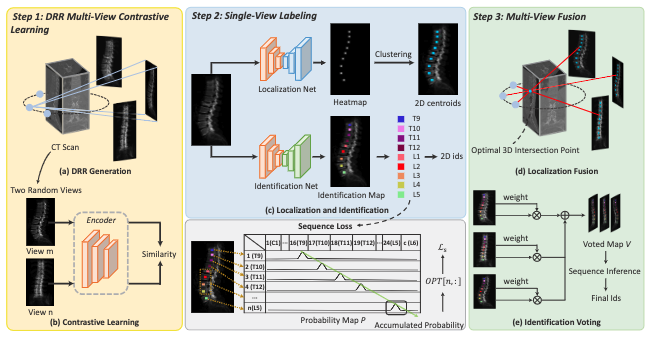

Multi-View Vertebra Localization and Identification from CT Images
基于CT图像的多视角脊椎定位与识别
====================================================================================

> Han Wu1, Jiadong Zhang1, Yu Fang1, Zhentao Liu1, Nizhuan Wang1, Zhiming Cui1(B), and Dinggang Shen1,2,3(B) 1 School of Biomedical Engineering, ShanghaiTech Univerisity, Shanghai, China <cuizm.neu.edu@gmail.com>, <dgshen@shanghaitech.edu.cn> 2 Shanghai United Imaging Intelligence Co. Ltd., Shanghai, China 3 Shanghai Clinical Research and Trial Center, Shanghai, China
> 上海科技大学生物医学工程学院cuizm.neu.edu @ <gmail.comdgshen@shanghaitech.edu.cn> 2上海联合影像智能有限公司，上海，中国有限公司、中国上海3中国上海临床研究中心

Abstract 摘要
-----------

Accurately localizing and identifying vertebra from CT im- ages is crucial for various clinical applications. However, most existing efforts are performed on 3D with cropping patch operation, suffering from the large computation costs and limited global information. In this paper, we propose a multi-view vertebra localization and identification from CT images, converting the 3D problem into a 2D localization and identifica- tion task on different views. Without the limitation of the 3D cropped patch, our method can learn the multi-view global information naturally. Moreover, to better capture the anatomical structure information from different view perspectives, a multi-view contrastive learning strategy is developed to pre-train the backbone. Additionally, we further propose a Sequence Loss to maintain the sequential structure embedded along the vertebrae. Evaluation results demonstrate that, with only two 2D net- works, our method can localize and identify vertebrae in CT images ac- curately, and outperforms the state-of-the-art methods consistently. Our code is available at <https://github.com/ShanghaiTech-IMPACTMulti-> View-Vertebra-Localization-and-Identification-from-CT-Images.

## 摘要

从CT图像中准确定位和识别脊椎对于各种临床应用至关重要。然而，大多数现有的努力是在3D上进行裁剪补丁操作，遭受大的计算成本和有限的全局信息。在本文中，我们提出了一个多视图的脊椎定位和识别从CT图像，转换到一个2D定位和识别任务的不同视图上的3D问题。该方法不受3D裁剪面片的限制，能够自然地学习多视点全局信息。此外，为了更好地捕捉从不同的视图角度的解剖结构信息，开发了多视图对比学习策略来预训练骨干。此外，我们还提出了一个序列丢失，以保持嵌入沿着椎骨的顺序结构。 评价结果表明，只有两个二维网络，我们的方法可以定位和识别CT图像中的椎骨准确，并优于国家的最先进的方法一致。我们的代码可从<https://github.com/ShanghaiTech-IMPACT/Multi-View-Vertebra-Localization-and-Identification-from-CT-Images>获得。

> Keywords: Vertebra localization and identification - Contrastive learning - Sequence Loss.
> 关键词：脊椎定位和识别-对比学习-序列丢失。

1 Introduction 1引言
------------------

Automatic Localization and identification of vertebra from CT images are cru- cial in clinical practice, particularly for surgical planning, pathological diagnosis, and post-operative evaluation\[1,9,10\]. However, the process is challenging due to the significant shape variations of vertebrae with different categories, such as lumbar and thoracic, and also the close shape resemblance of neighboring ver- tebrae. Apart from these intrinsic challenges, the arbitrary field-of-view (FOV) of different CT scans and the presence of metal implant artifacts also introduce additional difficulties to this task. With the advance of deep learning, many methods are devoted to tackling these challenges. For example, Lessmann et al. \[11\] employed a one-stage seg- mentation method to segment vertebrae with different labels for localization and arXiv:2307.12845v1 \[eess.IV\] 24 Jul 2023 2 H. Wu et al. identification. It is intuitive but usually involves many segmentation artifacts. Building upon this method, Masuzawa et al.\[12\] proposed an instance memory module to capture the neighboring information, but the long-term sequential in- formation is not well studied. Recently, two or multi-stage methods\[4,5,13,14,15\], that first localize the vertebra and further classify the detected vertebra patches, are proposed to achieve the state-of-the-art performance. And some additional modules, such as attention mechanism\[5\], graph optimization\[13\], and LSTM\[15\], are integrated to capture the sequential information of adjacent vertebrae. How- ever, all these methods are performed on 3D patches, where the global infor- mation of the CT scan is destroyed and cannot be well-captured. Moreover, due to the lack of pre-trained models in 3D medical imaging, networks trained from scratch using a small dataset often lead to severe overfitting problems with inferior performance. In this paper, to tackle the aforementioned challenges, we present a novel framework that converts the 3D vertebra labeling problem into a multi-view 2D vertebra localization and identification task. Without the 3D patch limi- tation, our network can learn 2D global information naturally from different view perspectives, as well as leverage the pre-trained models from ImageNet\[6\]. Specifically, given a 3D CT image, we first generate multi-view 2D Digitally Reconstructed Radiograph (DRR) projection images. Then, a multi-view con- trastive learning strategy is designed to further pre-train the network on this specific task. For vertebra localization, we predict the centroid of each vertebra in all DRR images and map the 2D detected centroids of different views back into the 3D CT scan using a least-squares algorithm. As for vertebra identifica- tion, we formulate it as a 2D segmentation task that generates vertebra labels around vertebra centroids. Particularly, a Sequence Loss, based on dynamic pro- gramming, is introduced to maintain the sequential information along the spine vertebrae in the training stage, which also serves as a weight to vote the multi- view 2D identification results into the 3D CT image for more reliable results. Our proposed method is validated on a public challenging dataset\[17\] and achieved the state-of-the-art performance both in vertebra localization and identification. Moreover, more evaluation results on a large-scale in-house dataset collected in real-world clinics (with 500 CT images) are provided in the supplementary ma- terials, further demonstrating the effectiveness and robustness of our framework.

## 1. 引子

从CT图像中自动定位和识别椎骨在临床实践中至关重要，特别是对于手术计划、病理诊断和术后评估\[1，9，10\]。然而，由于不同类别的椎骨（例如腰椎和胸椎）的显著形状变化以及相邻椎骨的紧密形状相似性，该过程是具有挑战性的。除了这些固有的挑战之外，不同CT扫描的任意视场（FOV）和金属植入物伪影的存在也给这项任务带来了额外的困难。
随着深度学习的发展，许多方法都致力于应对这些挑战。例如，Lessmann et al.\[11\]采用一阶段分割方法，用不同的标签分割椎骨进行定位和识别。它是直观的，但通常涉及许多分割伪影。 在此方法的基础上，Masuzawa等人。\[12\]提出了一个实例存储模块来捕获相邻信息，但长期的顺序信息没有得到很好的研究。最近，提出了两个或多个阶段的方法\[4，5，13，14，15\]，其首先定位椎骨并进一步对检测到的椎骨块进行分类，以实现最先进的性能。一些额外的模块，如注意力机制\[5\]，图形优化\[13\]和LSTM\[15\]，被集成以捕获相邻椎骨的顺序信息。然而，所有这些方法都是在3D贴片上执行的，其中CT扫描的全局信息被破坏并且不能被很好地捕获。此外，由于3D医学成像中缺乏预训练模型，使用小数据集从头开始训练的网络通常会导致严重的过拟合问题，性能较差。
在本文中，为了解决上述挑战，我们提出了一种新的框架，将3D椎骨标记问题转化为多视图2D椎骨定位和识别任务。在没有3D补丁限制的情况下，我们的网络可以从不同的视角自然地学习2D全局信息，并利用ImageNet\[6\]中的预训练模型。具体而言，给定3D CT图像，我们首先生成多视图2D数字重建射线照相（DRR）投影图像。然后，设计了一种多视图对比学习策略，以进一步在该特定任务上对网络进行预训练。对于椎骨定位，我们预测在所有DRR图像中的每个椎骨的质心，并使用最小二乘算法将不同视图的2D检测到的质心映射回3D CT扫描。至于椎骨识别，我们将其制定为在椎骨质心周围生成椎骨标签的2D分割任务。 特别地，基于动态编程的序列丢失被引入以在训练阶段保持沿着脊柱椎骨的序列信息，其还用作权重以将多视图2D识别结果投票到3D CT图像中以获得更可靠的结果。我们提出的方法在公共挑战数据集\[17\]上进行了验证，并在椎骨定位和识别方面实现了最先进的性能。此外，在补充材料中提供了在真实世界诊所中收集的大规模内部数据集（具有500张CT图像）上的更多评估结果，进一步证明了我们的框架的有效性和鲁棒性。

2 Methodology 2方法论
------------------

An overview of our proposed method for vertebra localization and identification using multi-view DRR from CT scans is shown in Fig. 1, which mainly consists of three steps. Step 1 is to generate DRR images, followed by a multi-view contrastive learning strategy to pre-train the backbone. Step 2 aims to finish 2D single-view vertebra localization and identification, and step 3 is to map the 2D results back to 3D with a multi-view fusion strategy. We will elaborate our framework in this section. Multi-View Vertebra Localization and Identification from CT Images 3Multi-View Vertebra Localization and Identification from CT Images 31(C1) --- 16(T9) 17(T10) 18(T11) 19(T12) --- 24(L5) c (L6) 1 (T9) 2 (T10) 3 (T11) 4 (T12) --- n(L5) Step 3: Multi-View FusionStep 2: Single-View LabelingStep 1: DRR Multi-View Contrastive Learning CT Scan Identification Map Clustering Heatmap 2D centroids Encoder (a) DRR Generation (b) Contrastive Learning View m View n Two Random Views (d) Localization Fusion Optimal 3D Intersection Point Voted Map V Sequence Inference Final Ids (e) Identification Voting T9 T10 T11 T12 L1 L2 L3 L4 L5 Localization Net Identification Net 2D ids Probability Map P Accumulated Probability ≸⤩ Similarity ᡁᡂᡆ䙰ᡦ, : 䙱 (c) Localization and Identification Sequence Loss weight weight weight Fig. 1. An overview of the proposed method, including (a) DRR Generation, (b) DRR multi-view contrastive learning, (c) single-view vertebra localization and identification, (d) multi-view localization fusion, and (e) multi-view identification voting. The imple- mentation of Sequence Loss is also illustrated.

## 2. 方法

我们提出的使用来自CT扫描的多视图DRR进行椎骨定位和识别的方法的概述如图_1所示。主要由三个步骤组成。

    - 步骤1是生成DRR图像，随后是多视图对比学习策略以预训练骨干。
    - 第二步是完成单视图的二维脊椎定位和识别，
    - 第三步是利用多视图融合策略将二维结果映射回三维。

我们将在本节中详细阐述我们的框架。

### 2.1 DRR Multi-View Contrastive Learning

2.1 DRR多视角对比学习

DRR Generation. To accurately localize and identify each vertebra in CT im- ages, we convert the 3D task into 2D, where global information can be naturally captured from different views, avoiding the large computation of 3D models. To achieve this, DRR (Digitally Reconstructed Radiograph) technique, a simulation procedure for generating a radiograph similar to conventional X-ray image, is performed by projecting a CT image onto a virtual detector plane with a virtual X-ray source. In this way, we can generate K DRR projection images of a CT image for every 360/K degree. The 3D labeling problem can then be formulated as a multi-view localization and identification task in a 2D manner. Specifically, the 2D ground-truth are generated by projecting the 3D centroids and labels onto the 2D image following the DRR projection settings. DRR Multi-View Contrastive Learning. After DRR generation, our goal is to localize and identify the vertebra on DRR images. However, as the dataset for the vertebra task is relatively small due to time-consuming manual annota- tion, we design a new multi-view contrastive learning strategy to better learn the vertebrae representation from various views. Unlike previous contrastive learn- ing methods, where the pretext is learned from numerous augmented negative and positive samples\[2,3,7,8\], e.g., random crop, image flip, rotation and resize, the multi-view DRR images generated from the same CT image share consis- tent anatomical information, which are natural positive samples. Based on this insight, we pre-train our network backbone using the Simsiam \[3\] approach to Fig. 1. An overview of the proposed method, including (a) DRR Generation, (b) DRR multi-view contrastive learning, (c) single-view vertebra localization and identification, (d) multi-view localization fusion, and (e) multi-view identification voting. The imple- mentation of Sequence Loss is also illustrated.

DRR生成。为了准确定位和识别CT图像中的每个椎骨，我们将3D任务转换为2D，其中可以从不同视图自然地捕获全局信息，避免了3D模型的大量计算。为了实现这一点，通过将CT图像投影到具有虚拟X射线源的虚拟检测器平面上来执行DRR（数字重建射线照片）技术，即用于生成类似于常规X射线图像的射线照片的模拟过程。以这种方式，我们可以针对每360/K度生成CT图像的K个DRR投影图像。然后，3D标记问题可以被公式化为以2D方式的多视图定位和识别任务。具体地，通过遵循DRR投影设置将3D质心和标签投影到2D图像上来生成2D真罩。DRR多视图对比学习。在DRR生成之后，我们的目标是在DRR图像上定位和识别椎骨。 然而，由于椎骨任务的数据集相对较小，由于耗时的手动注释，我们设计了一种新的多视图对比学习策略，以更好地学习从各种视图的椎骨表示。与之前的对比学习方法不同，其中从许多增强的否定和肯定样本中学习借口\[2，3，7，8\]，例如，随机裁剪、图像翻转、旋转和调整大小，从同一CT图像生成的多视图DRR图像共享一致的解剖信息，这是自然的阳性样本。基于这一见解，我们使用Simsiam \[3\]方法对图1进行了预训练。1.所提出的方法的概述，包括（a）DRR生成，（B）DRR多视图对比学习，（c）单视图椎骨定位和识别，（d）多视图定位融合，以及（e）多视图识别投票。还说明了序列丢失的实现。

### 2.1 DRR Multi-View Contrastive Learning

2.1 DRR多视角对比学习

DRR Generation. To accurately localize and identify each vertebra in CT im- ages, we convert the 3D task into 2D, where global information can be naturally captured from different views, avoiding the large computation of 3D models. To achieve this, DRR (Digitally Reconstructed Radiograph) technique, a simulation procedure for generating a radiograph similar to conventional X-ray image, is performed by projecting a CT image onto a virtual detector plane with a virtual X-ray source. In this way, we can generate K DRR projection images of a CT image for every 360/K degree. The 3D labeling problem can then be formulated as a multi-view localization and identification task in a 2D manner. Specifically, the 2D ground-truth are generated by projecting the 3D centroids and labels onto the 2D image following the DRR projection settings. DRR Multi-View Contrastive Learning. After DRR generation, our goal is to localize and identify the vertebra on DRR images. However, as the dataset for the vertebra task is relatively small due to time-consuming manual annota- tion, we design a new multi-view contrastive learning strategy to better learn the vertebrae representation from various views. Unlike previous contrastive learn- ing methods, where the pretext is learned from numerous augmented negative and positive samples\[2,3,7,8\], e.g., random crop, image flip, rotation and resize, the multi-view DRR images generated from the same CT image share consis- tent anatomical information, which are natural positive samples. Based on this insight, we pre-train our network backbone using the Simsiam \[3\] approach to 4 H. Wu et al. encode two random views from the same CT image as a key and query, as shown in Fig. 1 (b), in the aims of learning the invariant vertebrae representation from different views.

### 2.1 DRR多视角对比学习

**DRR生成** 为了准确定位和识别CT图像中的每个椎骨，我们将3D任务转换为2D，其中可以从不同视图自然地捕获全局信息，避免了3D模型的大量计算。为了实现这一点，通过将CT图像投影到具有虚拟X射线源的虚拟检测器平面上来执行DRR（数字重建射线照片）技术，即用于生成类似于常规X射线图像的射线照片的模拟过程。以这种方式，我们可以针对每360/K度生成CT图像的K个DRR投影图像。然后，3D标记问题可以被公式化为以2D方式的多视图定位和识别任务。具体地，通过遵循DRR投影设置将3D质心和标签投影到2D图像上来生成2D真罩。

**DRR多视图对比学习** 在DRR生成之后，我们的目标是在DRR图像上定位和识别椎骨。 然而，由于椎骨任务的数据集相对较小，由于耗时的手动注释，我们设计了一种新的多视图对比学习策略，以更好地学习从各种视图的椎骨表示。与之前的对比学习方法不同，其中从许多增强的否定和肯定样本中学习借口\[2，3，7，8\]，例如，随机裁剪、图像翻转、旋转和调整大小，从同一CT图像生成的多视图DRR图像共享一致的解剖信息，这是自然的阳性样本。基于这一见解，我们使用Simsiam \[3\]方法对4H预训练我们的网络骨干。将来自同一CT图像的两个随机视图编码为密钥和查询，如图所示。1（B），目的是从不同视图学习不变的椎骨表示。

### 2.2 Single-View Vertebra Localization

2.2单视图椎骨定位

With multi-view DRR images, the 3D vertebra localization problem is converted into a 2D vertebra centroid detection task, followed by a multi-view fusion strategy (as introduced in Sec. 2.4) that transforms the 2D results to 3D. To achieve this, we utilize the commonly-used heatmap regression strategy for 2D vertebra centroid detection. Specifically, for each vertebra in a DRR image, our model is trained to learn the contextual heatmap defined on the ground-truth 2D cen- troid using a Gaussian kernel. During inference, we apply a fast peak search clustering method \[16\] to localize the density peaks on the regressed heatmap as the predicted centroid. Benefiting from the pre-trained models from multi- view contrastive learning, our method can capture more representative features from different views. Further, compared to existing 3D methods, our approach performs vertebra localization on several DRR images with a fusion strategy, making it more robust to the situation of missing detection in certain views.

### 2.2单视图椎骨定位

利用多视图DRR图像，3D椎骨定位问题被转换成2D椎骨质心检测任务，随后是多视图融合策略（如在第12节中介绍的）。2.4)将2D结果转换为3D。为了实现这一点，我们利用常用的**热图回归**策略进行2D椎骨质心检测。具体而言，对于DRR图像中的每个椎骨，我们的模型被训练为使用高斯内核学习在真罩2D质心上定义的上下文热图。在推断过程中，我们应用快速峰值搜索聚类方法\[16\]将回归热图上的密度峰值定位为预测的质心。得益于多视图对比学习的预训练模型，我们的方法可以从不同的视图中捕获更具代表性的特征。 此外，与现有的3D方法相比，我们的方法进行椎骨定位的几个DRR图像的融合策略，使其更强大的情况下，在某些视图中的丢失检测。

### 2.3 Single-View Vertebra Identification

2.3单视图椎骨识别

After the vertebrae localization, we further predict the label of each vertebra using an identification network on multi-view DRR images. Unlike other 3D methods that require cropping vertebra patches for classification, our identifi- cation network performs on 2D, allowing us to feed the entire DRR image into the network, which can naturally capture the global information. Specifically, we use a segmentation model to predict the vertebra labels around the detected vertebra centroids, i.e., a 22mm × 22mm square centered at the centroid. During the inference of single-view, we analyze the pixel-wise labels in each square and identify the corresponding vertebra with the majority number of labels. Sequence Loss. In the identification task, we observe that the vertebra labels are always in a monotonically increasing order along the spine, which implies the presence of sequential information. To better exploit this property and enhance our model to capture such sequential information, we propose a Sequence Loss as an additional network supervision, ensuring the probability distribution along the spine follows a good sequential order. Specifically, as shown in Fig. 1, we compute a probability map P ∈ Rn×c for each DRR image by averaging the predicted pixel-wise possibilities in each square around the vertebra centroid from the identification network. Here, n is the number of vertebrae contained in this DRR image, and c indicates the number of vertebra categories (i.e., from C1 to L6). Due to the sequential nature of the vertebra identification problem, the optimal distribution of P is that the index of the largest probability in each row is in ascending order (green line in Fig. 1). To formalize this notion, we compute the Multi-View Vertebra Localization and Identification from CT Images 5 largest accumulated probability in ascending order, starting from each category in the first row and ending at the last row, using dynamic programming. The higher accumulated probability, the better sequential structure presented by this distribution. We set this accumulated probability as target profit, and aim to maximize it to enable our model to better capture the sequential structure in this DRR image. The optimal solution (OP T ) based on the dynamic programming algorithm is as: OP T \[i, j\] = { P \[i, j\] if j = 1 or i = 1 OP T \[i - 1, j - 1\] + D otherwise D = max(αP \[i, j - 1\], βP \[i, j\], αP \[i, j + 1\]), (1) where i ∈ \[1, n\] and j ∈ \[1, c\]. Here, α and β are two parameters that are designed to alleviate the influence of wrong-identified vertebra. Sequence Loss (Ls) is then defined as: Ls = 1 - max(OP T \[n, :\]) βn . (2) The overall loss function Lid for our identification network is: Lid = Lce + γLs, (3) where Lce and Ls refer to the Cross-Entropy loss and Sequence Loss, respectively. γ is a parameter to control the relative weights of the two losses.

### 2.3单视图椎骨识别

在椎骨定位之后，我们进一步使用多视图DRR图像上的识别网络来预测每个椎骨的标签。与其他需要裁剪椎骨块进行分类的3D方法不同，我们的识别网络在2D上执行，允许我们将整个DRR图像馈送到网络中，从而可以自然地捕获全局信息。具体地，我们使用分割模型来预测检测到的椎骨质心周围的椎骨标签，即，以质心为中心的22mm × 22mm正方形。在单视图的推断过程中，我们分析每个正方形中的逐像素标签，并利用大多数标签来识别对应的椎骨。序列丢失。在识别任务中，我们观察到椎骨标签总是沿着脊柱呈单调递增的顺序，这意味着存在顺序信息。 为了更好地利用这一特性并增强我们的模型以捕获这种顺序信息，我们提出了一种序列损失作为额外的网络监督，以确保沿着脊柱的概率分布遵循良好的顺序。具体地，如图1所示。1，我们通过对来自识别网络的椎骨质心周围的每个正方形中的预测像素可能性进行平均来计算每个DRR图像的概率图P ∈ Rn×c。这里，n是包含在该DRR图像中的椎骨的数量，并且c指示椎骨类别的数量（即，从C1到L6）。由于椎骨识别问题的顺序性质，P的最优分布是每行中最大概率的索引按升序排列（图中的绿色线）。①的人。 为了使这个概念形式化，我们使用动态编程从第一行中的每个类别开始并在最后一行结束，以升序计算来自CT图像的多视图椎骨定位和识别5最大累积概率。累积概率越高，该分布呈现的序列结构越好。我们将此累积概率设置为目标利润，并旨在使其最大化，以使我们的模型能够更好地捕获此DRR图像中的序列结构。基于动态规划算法的最优解（OP T）为：OP T \[i，j\] = { P \[i，j\] if j = 1 or i = 1 OP T \[i - 1，j - 1\] + D otherwise D = max（αP \[i，j - 1\]，βP \[i，j\]，αP \[i，j + 1\]），（1）其中i ∈ \[1，n\]且j ∈ \[1，c\].这里，α和β是被设计成减轻错误识别的椎骨的影响的两个参数。然后将序列丢失（Ls）定义为：Ls = 1 - max（OP T \[n，：\]）βn。 (2)我们的识别网络的总损失函数Lid为：其中Lce和Ls分别指交叉熵损失和序列损失。γ是控制两个损失的相对权重的参数。

### 2.4 Multi-View Fusion 2.4多视图融合

Localization Multi-View Fusion. After locating all the vertebrae in each DRR image, we fuse and map the 2D centroids back to 3D space by a least- squares algorithm, as illustrated in Fig. 1 (d). For a vertebra located in K views, we can track K target lines from the source points in DRR technique to the detected centroid on the DRR images. Ideally, the K lines should intersect at a unique point in the 3D space, but due to localization errors, this is always unachievable in practice. Hence, instead of finding a unique intersection point, we employ the least-squares algorithm to minimize the sum of perpendicular distances from the optimal intersection point to all the K lines, given by: D(p; A, N ) = K∑ k=1 D(p; ak, nk) = K∑ k=1 (ak - p)T (I - nknT k )(ak - p), (4) where p denotes the 3D coordinate of the optimal intersection point, ak and nk represent the point on the kth target line and the corresponding direction vector. By taking derivatives with respect to p, we get a linear equation of p as shown 6 H. Wu et al. in Eq. (5), where the optimal intersection point can be obtained by achieving the minimum distance to the K lines. ∂D ∂p = K∑ k=1 -2(I - nknT k )(ak - p) = 0 ⇒ Sp = q, S = K∑ k=1 (I - nknT k ), q = K∑ k=1 (I - nknT k )ak. (5) Identification Multi-View Voting. The Sequence Loss evaluates the quality of the predicted vertebra labels in terms of their sequential property. During inference, we further use this Sequence Loss of each view as weights to fuse the probability maps obtained from different views. We obtain the final voted identification map V of K views as: V = K∑ k=1 WkPk, Wk = (1 - Lk s ) ∑K a=1(1 - La s ) . (6) For each vertebra, the naive solution for obtaining vertebra labels is to ex- tract the largest probability from each row in voted identification map V . Despite the promising performance of the identification network, we still find some erro- neous predictions. To address this issue, we leverage the dynamic programming (described in Eq. (1)) again to correct the predicted vertebra labels in this voted identification map V . Specifically, we identify the index of the largest accumu- lated probability in the last row as the last vertebra category and utilize it as a reference to correct any inconsistencies in the prediction.
定位多视图融合。在定位每个DRR图像中的所有椎骨之后，我们通过最小二乘算法将2D质心融合并映射回3D空间，如图1所示。第1段（d）分段。对于位于K个视图中的椎骨，我们可以跟踪从DRR技术中的源点到DRR图像上的检测到的质心的K条目标线。理想地，K线应该在3D空间中的唯一点处相交，但是由于定位误差，这在实践中总是无法实现。因此，我们不是寻找唯一的交点，而是采用最小二乘算法来最小化从最佳交点到所有K条线的垂直距离之和，由下式给出：D（p; A，N）= K∑ k=1 D（p;其中p表示最佳交点的3D坐标，ak和nk表示第k条目标线上的点和对应的方向向量。 通过对p求导，我们得到p的线性方程，如图6H所示. Wu等人在Eq. (5)其中，最佳交点可以通过使到K条直线的距离最小来获得。D (5)多视角投票。序列损失评估预测的椎骨标签在它们的序列属性方面的质量。在推理过程中，我们进一步使用每个视图的序列损失作为权重来融合从不同视图获得的概率图。我们获得K个视图的最终投票识别图V为：V = K∑ k=1 WkPk，Wk =（1 - Lk s）∑K a=1（1 - La s）。(6)对于每个椎骨，用于获得椎骨标签的朴素解决方案是从投票识别图V中的每行提取最大概率。尽管识别网络的性能很好，但我们仍然发现一些错误的预测。 为了解决这个问题，我们利用动态规划（在等式2中描述）。(1))再次校正该投票识别图V中的预测椎骨标记。具体地，我们将最后一行中的最大累积概率的索引识别为最后一个椎骨类别，并利用它作为参考来校正预测中的任何不一致。

3 Experiments and Results
3实验和结果
--------------------------------

### 3.1 Dataset and Evaluation Metric

3.1数据集和评估指标

We extensively evaluate our method on the publicly available MICCAI VerSe19 Challenge dataset \[17\], which consists of 160 spinal CT with ground truth anno- tations. Specifically, following the public challenge settings, we utilize 80 scans for training, 40 scans for testing, and 40 scans as hidden data. To evaluate the performance of our method, we use the mean localization error (L-Error) and identification rate (Id-Rate) as the evaluation metrics, which are also adopted in the challenge. The L-Error is calculated as the average Euclidean distance be- tween the ground-truth and predicted vertebral centers. The Id-Rate is defined as the ratio of correctly identified vertebrae to the total number of vertebrae.
我们在公开可用的MICCAI VerSe 19 Challenge数据集\[17\]上广泛评估了我们的方法，该数据集由160个具有真罩注释的脊柱CT组成。具体来说，在公共挑战设置之后，我们使用80次扫描进行训练，40次扫描进行测试，40次扫描作为隐藏数据。为了评估我们的方法的性能，我们使用的平均定位误差（L-Error）和识别率（Id-Rate）作为评估指标，这也是通过在挑战。L误差计算为真实值与预测椎体中心之间的平均欧几里得距离。Id率定义为正确识别的椎骨与椎骨总数的比率。

### 3.2 Implementation Details

3.2实现细节

All CT scans are resampled to an isotropic resolution of 1 mm. For DRR Multi- View Contrastive Learning, we use ResNet50 as encoder and apply the SGD Multi-View Vertebra Localization and Identification from CT Images 7 Table 1. Results on the VerSe19 challenge dataset. Method Test Dataset Hidden Dataset Id-Rate(%) L-Error(mm) Id-Rate(%) L-Error(mm) Payer C.\[17\] 95.65 4.27 94.25 4.80 Lessmann N.\[17\] 89.86 14.12 90.42 7.04 Chen M. \[17\] 96.94 4.43 86.73 7.13 Sekuboyina A.\[18\] 89.97 5.17 87.66 6.56 Ours 98.12 1.79 96.45 2.17 optimizer with an initial learning rate of 0.0125, which follows the cosine decay schedule. The weight decay, SGD momentum, batch size and loss function are set to 0.0001, 0.9, 64, and cosine similarity respectively. We employ U-Net for both the localization and identification networks, using the pre-trained ResNet50 from our contrastive learning as backbone. Adam optimizer is set with an initial learning rate of 0.001, which is divided by 10 every 4000 iterations. Both networks are trained for 15k iterations. We empirically set α = 0.1, β = 0.8, γ = 1. All methods were implemented in Python using PyTorch framework and trained on an Nvidia Tesla A100 GPU with 40GB memory.
将所有CT扫描重新采样至Imm的各向同性分辨率。对于DRR多视图对比学习，我们使用ResNet 50作为编码器，并应用SGD多视图椎骨定位和从CT图像识别7表1。VerSe 19挑战数据集的结果。方法测试数据集隐藏数据集Id-率（%）L-误差（mm）Id-率（%）L-误差（mm）付款人C。\[17\]95.65 4.27 94.25 4.80莱斯曼N. \[17\]89.86 14.12 90.42 7.04陈明\[17\]96.94 4.43 86.73 7.13 Sekuboyina A. \[18\]89.97 5.17 87.66 6.56我们的98.12 1.79 96.45 2.17优化器，初始学习率为0.0125，遵循余弦衰减时间表。权重衰减、SGD动量、批量大小和损失函数分别设置为0.0001、0.9、64和余弦相似性。我们将U-Net用于定位和识别网络，使用我们的对比学习中预先训练的ResNet 50作为骨干。Adam优化器设置为初始学习率为0.001，每4000次迭代除以10。 两个网络都经过了15k次迭代的训练。我们凭经验设定α = 0.1，β = 0.8，γ = 1。所有方法都使用PyTorch框架在Python中实现，并在具有40GB内存的Nvidia Tesla A100 GPU上进行训练。

### 3.3 Comparison with SOTA Methods

3.3与SOTA方法的比较

We train our method on 70 CT images and tune the hyperparameter on the rest 10 CT images from the training data. We then evaluate it on both testing and hidden datasets, following the same setting as the challenge. In the comparison, our method is compared with four methods which are the first four positions in the benchmark of this challenge\[17\]. The experimental results are presented in Table 1. Our method achieves Id-Rate of 98.12% and L-Error of 1.79 mm on the test dataset, and Id-Rate of 96.45% and L-Error of 2.17 mm on the hidden dataset, which achieves the leading performance both in localization and identifi- cation tasks with just two 2D networks. Compared to these methods performed on 3D with random cropping or patch-wise method (Payer C.\[17\], Lessmann N.\[17\] and Chen M.\[17\]), our 2D strategy can capture more reliable global and sequential information in all 2D projection images which can improve the la- beling performance, especially the localization error. Compared to those using 2D MIP(Sekuboyina A.\[18\]), our DRR multi-view projection and fusion strategy can provide superior performance by analyzing more views and introducing the geometry information carried by varied DRR projections naturally.
我们在70幅CT图像上训练我们的方法，并从训练数据中调整其余10幅CT图像上的超参数。然后，我们在测试和隐藏数据集上进行评估，并遵循与挑战相同的设置。在比较中，我们的方法与四种方法进行了比较，这四种方法是该挑战的基准中的前四个位置\[17\]。实验结果示于表1中。我们的方法在测试数据集上实现了98.12%的Id-Rate和1.79 mm的L-Error，在隐藏数据集上实现了96.45%的Id-Rate和2.17 mm的L-Error，仅用两个2D网络就实现了定位和识别任务的领先性能。与在3D上使用随机裁剪或分块方法（Payer C. \[17\]，Lessmann N. \[17\]和Chen M. \[17\])因此，我们的2D策略可以在所有2D投影图像中捕获更可靠的全局和顺序信息，从而可以改善标记性能，特别是定位误差。 与2D MIP（Sekuboyina A. \[18\])DRR多视图投影融合策略可以分析更多的视图，并自然地引入不同DRR投影所携带的几何信息，从而提供上级的性能。

### 3.4 Ablation Study 3.4消融研究

Ablation Study of Key Components. We conduct an ablation study on the VerSe19 dataset to demonstrate the effectiveness of each component. As pre- sented in Table 2, we build the basic network for the vertebra localization and identification with a bagging strategy, where for each vertebra, we opt for the ID that is predicted by the majority of views, when not using weighted voting, and 8 H. Wu et al. Table 2. Ablation study results of key components. Baseline Pre-train Sequence Loss Voting Id-Rate(%) Test Dataset Hidden dataset X 84.00 83.45 X X 85.58 86.52 X X X 89.41 90.54 X X X X 98.12 96.45 (a) (b) Fig. 2. (a) The Id-Rate and L-Error of different K. (b) Comparison between different K from the final predicted CT scan on limited FOV and metal artifacts cases (red for ground truth and green for predictions). K = 10, denoted as Baseline. Pre-train, Sequence Loss, and voting in Table 2 represent the addition of the multi-view contrastive learning, Sequence Loss, and multi-view voting one by one. Pre-trained from ImageNet is used when not uti- lizing our contrastive learning pre-trained parameters. Specifically, the Baseline achieves Id-Rate of 84.00% and 83.54% on two datasets. With the contrastive learning pre-trained parameters, we achieve 1.88% and 2.98% improvements over the ImageNet pre-trained, respectively. This shows the pre-trained parameters of the backbone obtained from our contrastive learning can effectively facilitate the network to learn more discriminative features for identification than the model learning from scratch. Sequence Loss provides extra supervision for sequential information, and results in 3.53% and 4.02% increase, illustrating the signifi- cance of capturing the sequential information in the identification task. Finally, multi-view weighted voting yields the best results with 98.12% and 96.45% on Multi-View Vertebra Localization and Identification from CT Images 9 the two datasets, indicating the robustness of our multi-view voting when the identification errors occurred in a small number of DRR images can be corrected by other DRR prediction results. Ablation Study of Projection Number. We also conduct an ablation study on the same dataset to further evaluate the impact of the projection number K. The results are presented in Fig. 2, indicating a clear trend of performance improvements as the number of projections K increases from 5 to 10. How- ever, when K increases to 20, the performance is just comparable to that of 10. We analyze that using too few views may result in inadequate and unreliable anatomical structure representation, leading to unsatisfactory results. On the other hand, too many views may provide redundant information, resulting in comparable results but with higher computation cost. Therefore, K is set to 10 as a trade-off between accuracy and efficiency.
关键组件的消融研究。我们对VerSe19数据集进行了消融研究，以证明每个组件的有效性。如表2中所示，我们利用装袋策略构建用于椎骨定位和识别的基本网络，其中对于每个椎骨，当不使用加权投票时，我们选择由大多数视图预测的ID和8H。Wu等人，表2.关键部件消融研究结果。基线训练前序列丢失投票率（%）测试数据集隐藏数据集X 84.00 83.45 X 85.58 86.52 X X X 89.41 90.54 X X X 98.12 96.45（a）（b）图2. (a)不同K. (b)在有限FOV和金属伪影情况下，来自最终预测CT扫描的不同K之间的比较（红色表示真实情况，绿色表示预测）。K = 10，表示为基线。 表2中的预训练、序列丢失和投票表示逐个添加多视图对比学习、序列丢失和多视图投票。当不使用我们的对比学习预训练参数时，使用来自ImageNet的预训练参数。具体而言，基线在两个数据集上实现了84.00%和83.54%的Id率。通过对比学习预训练参数，我们比ImageNet预训练分别提高了1.88%和2.98%。这表明，从我们的对比学习获得的骨干的预训练参数可以有效地促进网络学习比从头开始的模型学习更多的鉴别特征用于识别。序列丢失为序列信息提供了额外的监督，分别提高了3.53%和4.02%，说明了序列信息捕获在识别任务中的重要性。最后，多视图加权投票产生最好的结果为98。12%和96.45%，表明我们的多视图投票的鲁棒性时，发生在少量的DRR图像的识别错误，可以纠正其他DRR预测结果。突出数的消融研究。我们还对同一数据集进行了消融研究，以进一步评估投影数K的影响。结果示于图1中。2，表明随着投影数量K从5增加到10，性能改善的明显趋势。然而，当K增加到20时，性能仅与10的性能相当。我们分析，使用太少的视图可能会导致不充分和不可靠的解剖结构表示，导致不满意的结果。另一方面，太多的视图可能提供冗余信息，导致可比较的结果，但具有更高的计算成本。 因此，将K设置为10作为准确性和效率之间的折衷。

4 Conclusion 4结论
----------------

In this paper, we propose a novel multi-view method for vertebra localization and identification in CT images. The 3D labeling problem is converted into a multi-view 2D localization and identification task, followed by a fusion strategy. In particular, we propose a multi-view contrastive learning strategy to better learn the invariant anatomical structure information from different views. And a Sequence Loss is further introduced to enhance the framework to better cap- ture sequential structure embedded in vertebrae both in training and inference. Evaluation results on a public dataset demonstrate the advantage of our method.
在本文中，我们提出了一种新的多视图方法的脊椎定位和识别CT图像。3D标签问题被转换为多视图2D定位和识别任务，其次是融合策略。特别是，我们提出了一个多视图对比学习策略，以更好地学习不变的解剖结构信息，从不同的视图。并进一步引入序列丢失来增强框架，以便在训练和推理两方面更好地捕获嵌入在椎骨中的序列结构。在一个公共数据集上的评估结果证明了我们的方法的优势。

## References

1. Burns, J.E., Yao, J., Muñoz, H., Summers, R.M.: Automated detection, localizanclusion

In this paper, we propose a novel multi-view method for vertebra localization
and identification in CT images. The 3D labeling problem is converted into a
multi-view 2D localization and identification task, followed by a fusion strategy.
In particular, we propose a multi-view contrastive learning strategy to better
learn the invariant anatomical structure information from different views. And
a Sequence Loss is further introduced to enhance the framework to better cap-
ture sequential structure embedded in vertebrae both in training and inference.
Evaluation results on a public dataset demonstrate the advantage of our method.

## References

1. Burns, J.E., Yao, J., Muñoz, H., Summers, R.M.: Automated detection, localiza-
tion, and classification of traumatic vertebral body fractures in the thoracic and
lumbar spine at ct. Radiology 278(1), 64–73 (2016)
2. Chen, T., Kornblith, S., Norouzi, M., Hinton, G.: A simple framework for con-
trastive learning of visual representations. In: International conference on machine
learning. pp. 1597–1607. PMLR (2020)
3. Chen, X., He, K.: Exploring simple siamese representation learning. In: Proceedings
of the IEEE/CVF conference on computer vision and pattern recognition. pp.
15750–15758 (2021)
4. Cheng, P., Yang, Y., Yu, H., He, Y.: Automatic vertebrae localization and segmen-
tation in ct with a two-stage dense-u-net. Scientific Reports 11(1), 1–13 (2021)
5. Cui, Z., Li, C., Yang, L., Lian, C., Shi, F., Wang, W., Wu, D., Shen, D.: Vertnet:
Accurate vertebra localization and identification network from ct images. In: Med-
ical Image Computing and Computer Assisted Intervention–MICCAI 2021: 24th
International Conference, Strasbourg, France, September 27–October 1, 2021, Pro-
ceedings, Part V 24. pp. 281–290. Springer (2021)
10 H. Wu et al.
6. Deng, J., Dong, W., Socher, R., Li, L.J., Li, K., Fei-Fei, L.: Imagenet: A large-
scale hierarchical image database. In: 2009 IEEE conference on computer vision
and pattern recognition. pp. 248–255. Ieee (2009)
7. Grill, J.B., Strub, F., Altché, F., Tallec, C., Richemond, P., Buchatskaya, E., Do-
ersch, C., Avila Pires, B., Guo, Z., Gheshlaghi Azar, M., et al.: Bootstrap your own
latent-a new approach to self-supervised learning. Advances in neural information
processing systems 33, 21271–21284 (2020)
8. He, K., Fan, H., Wu, Y., Xie, S., Girshick, R.: Momentum contrast for unsupervised
visual representation learning. In: Proceedings of the IEEE/CVF conference on
computer vision and pattern recognition. pp. 9729–9738 (2020)
9. Knez, D., Likar, B., Pernuš, F., Vrtovec, T.: Computer-assisted screw size and in-
sertion trajectory planning for pedicle screw placement surgery. IEEE transactions
on medical imaging 35(6), 1420–1430 (2016)
10. Kumar, R.: Robotic assistance and intervention in spine surgery. In: Spinal Imaging
and Image Analysis, pp. 495–506. Springer (2014)
11. Lessmann, N., Van Ginneken, B., De Jong, P.A., Išgum, I.: Iterative fully convo-
lutional neural networks for automatic vertebra segmentation and identification.
Medical image analysis 53, 142–155 (2019)
12. Masuzawa, N., Kitamura, Y., Nakamura, K., Iizuka, S., Simo-Serra, E.: Automatic
segmentation, localization, and identification of vertebrae in 3d ct images using
cascaded convolutional neural networks. In: Medical Image Computing and Com-
puter Assisted Intervention–MICCAI 2020: 23rd International Conference, Lima,
Peru, October 4–8, 2020, Proceedings, Part VI 23. pp. 681–690. Springer (2020)
13. Meng, D., Mohammed, E., Boyer, E., Pujades, S.: Vertebrae localization, segmen-
tation and identification using a graph optimization and an anatomic consistency
cycle. In: Lian, C., Cao, X., Rekik, I., Xu, X., Cui, Z. (eds.) Machine Learning in
Medical Imaging. pp. 307–317. Springer Nature Switzerland, Cham (2022)
14. Payer, C., Stern, D., Bischof, H., Urschler, M.: Coarse to fine vertebrae localization
and segmentation with spatialconfiguration-net and u-net. In: VISIGRAPP (5:
VISAPP). pp. 124–133 (2020)
15. Qin, C., Zhou, J., Yao, D., Zhuang, H., Wang, H., Chen, S., Shi, Y., Song, Z.:
Vertebrae labeling via end-to-end integral regression localization and multi-label
classification network. IEEE Transactions on Neural Networks and Learning Sys-
tems 33(6), 2726–2736 (2021)
16. Rodriguez, A., Laio, A.: Clustering by fast search and find of density peaks. science
344(6191), 1492–1496 (2014)
17. Sekuboyina, A., Husseini, M.E., Bayat, A., Löffler, M., Liebl, H., Li, H., Tetteh,
G., Kukačka, J., Payer, C., Štern, D., et al.: Verse: A vertebrae labelling and
segmentation benchmark for multi-detector ct images. Medical image analysis 73,
102166 (2021)
18. Sekuboyina, A., Rempfler, M., Kukačka, J., Tetteh, G., Valentinitsch, A., Kirschke,
J.S., Menze, B.H.: Btrfly net: Vertebrae labelling with energy-based adversarial
learning of local spine prior. In: Medical Image Computing and Computer As-
sisted Intervention–MICCAI 2018: 21st International Conference, Granada, Spain,
September 16-20, 2018, Proceedings, Part IV 11. pp. 649–657. Springer (2018)

## Multi-View Vertebra Localization and Identification from CT Images

### Supplementary Material

Paper ID: 534
Table 1. Evaluation results on a large-scale in-house dataset collected from the prac-
tical clinics with 500 CT scans divided into 300 for training, 100 for testing, and 100
for validation. We train the model on the training dataset, and further evaluate it on
the test and validation dataset with K set to 10.
Test dataset Validation dataset
Id-Rate(%) L-Error(mm) Id-Rate(%) L-Error(mm)
Cer. 99.67 1.31 99.55 1.51
Tho. 98.24 1.34 99.00 1.48
Lum. 99.31 1.35 99.54 1.50
All 98.62 1.34 99.04 1.49
Fig. 1. Qualitative results on typical challenging cases: large field of view(1, 6), metal
artifacts (2, 3), pathological spines (4), and limited field of view (5).(Green for predic-
tion and red for ground truth.
